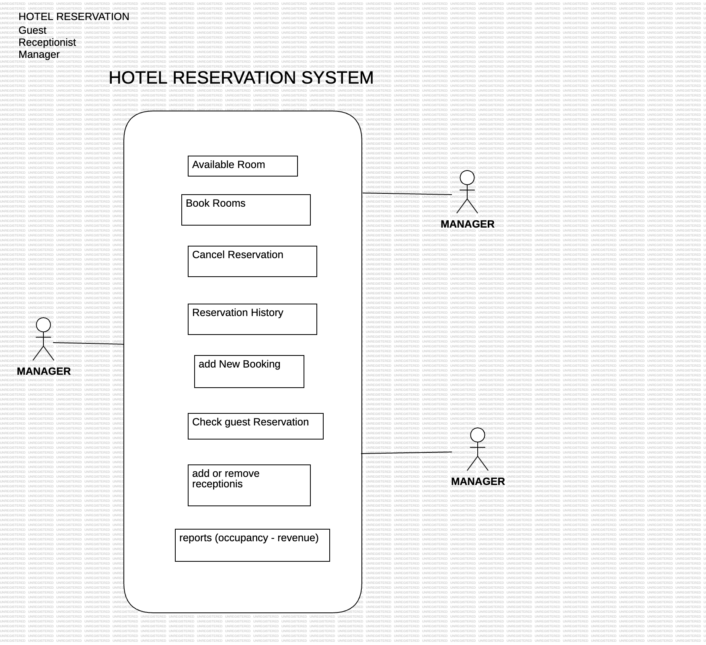

# MID EXAM JUL

## HOTEL RESERVATION

### User Stories

#### 👨🏼 Guest:

* As a Guest, I want to search available rooms so that I can booked on.
* As a Guest, I want to cancel my reservation so that I don't have any penalty income.
* As a Guest, I want to have a reservation histoy.

#### 👩🏻‍💼 Receptionist:

* As a receptionist, I want to booked new reservations so that guest I can help guest with their reservations.
* As a receptionist, I want to update or cancel booking guest reservations so that as a Hotel can handle our occupancy.
* As a receptionist, I want to list guest reservation history.

#### 👨🏻‍✈️ Manager: 

* As a Manger, I want to add or update creew menber of our staff.
* As a Manager, I want to view occupancy reports.
* As a Manager, I want to generate renevnue reports.

---------------

### Use Case

#### Guest: 

* Title: Search availabilable rooms
* Actor: Guest
* Main Flow: 
  * Select a range of date for my booked.
  * System display available room for a specific dates and prices
  * customer select room
  * system provide different ways to pay.
  * customer pay for a room in a specific date
  * system provide report for this transaction

#### Receptionist

	* Title: Update or cancel booking guest reservations
	* Actor: receptionist 
 * Main flow: 
   * Search a booking recervation base on ID
   * System display a specific reservation.
   * Receptionist has option to cancel or uptete information.
   * System provide a summary of transaction made for receptionist

___________

### Use Case Diagram

 